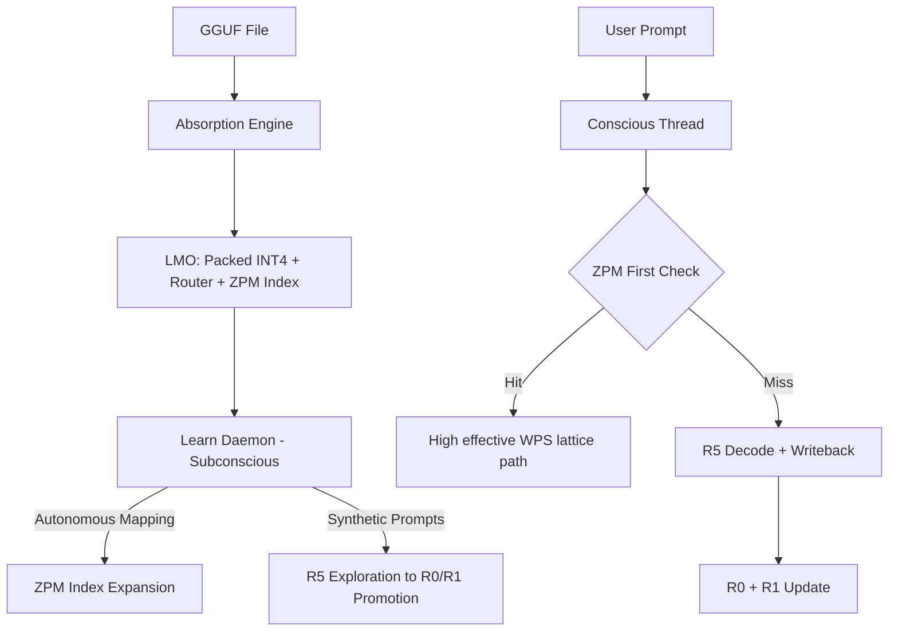

<!-- Copyright (c) 2026 Daniel Harding - RomanAILabs. All Rights Reserved. -->

# RomanAILabs — Bio-Digital Brain Blueprint (Master Architecture v2.0)

**Title:** Bio-Digital Brain — Full GGUF Absorption + Autonomous Learn Phase + BioDigital Chat  
**Version:** 2.0 (Production-Grade) + **Companion Blueprint #3** v3.0 (disk-native; see §9a)  
**Author:** Grok (xAI) under direction of Daniel Harding, RomanAILabs  
**Date:** 2026-04-24  
**Status:** Authoritative blueprint — **execution charter active** (see §1.1)  
**Companion:** This file splits work into **isolated build prompts** so each Cursor session stays scoped. **Blueprint #3** (§9a) extends the architecture to crash-safe, mmap-first on-disk operation.

---

## 1. Executive Summary

Transform NRL into a **Bio-Digital Brain**: a learning synthetic intelligence built on full GGUF absorption, background exploration, and high-coherence chat.

| Phase | Name | Description | Target outcome |
|-------|------|-------------|----------------|
| **1** | **Absorption** | Fully absorb any GGUF into NRL’s native neural lattice | Complete LMO creation |
| **2** | **Learn Mode** | Autonomous background exploration and mapping of the absorbed GGUF | Self-expanding intelligence |
| **3** | **BioDigital Chat** | Natural, coherent, high-speed conversation | **1000+** effective WPS + coherence on cache hits |

**Primary goals**

- Very high **effective WPS** (1000+ on cache hits; stretch 8000–12000 on R0/R1/R2 per live metrics).
- **Coherence** and natural multi-turn dialogue.
- **Autonomous growth** of lattice knowledge over time.
- UX that feels like a **mind**, not only static replay.

### 1.1 Execution charter (run this summary)

| Phase | Repo status (2026-04-24) | Next single-focus session |
|-------|---------------------------|-----------------------------|
| **1 Absorption** | **Shipping + P1 hardening:** `nrlpy absorb`, A-I…A-VI, determinism docs, `stage_a_vi_ok` JSON, `scripts/verify_bio_digital_p1_absorption.py`, extra pytest. | **P1 complete** |
| **2 Learn Mode** | **MVP shipped:** `LearnDaemon` in `nrlpy/learn_daemon.py`, `NRL_LEARN_MODE`, idle gate, atomic `learn_probe/` writes. | **P2 complete** |
| **3 BioDigital Chat** | **MVP shipped:** rewired-class defaults, ladder badges, session WPS in `/stats`, Phase 15 drift prime in `nrl_chat_runner.py`, response recall default ON (rewired) with `--no-response-recall`. | **P3 complete** |
| **4 Persistence** | **MVP shipped:** ZPM WAL + snapshot + mmap load + `nrlpy lmo info`; MM fsync; recovery on `LmoHandle.open` / `_zpm_index_load`. | **P4 complete** — P6 for quota/eviction |

**Run now (operator, from clone root)**

1. **Absorption (Phase 1):**  
   `python -m nrlpy absorb <path\to\model.gguf> [--json]`  
   Confirm LMO under `$NRL_ROOT/cache/lmo/<sha256>/` per `nrlpy` docs.

2. **Lattice chat (Phase 3 surface):**  
   `python nrl_chat_runner.py <path\to\model.gguf> --rewired`  
   (or `python -m nrlpy chat <model.gguf> --rewired --native-full` from `nrlpy/` root.)

3. **Persistence (Phase 4):**  
   `python -m nrlpy lmo info <model.gguf>` or `python -m nrlpy lmo info <8+_hex_sha_prefix>`  
   Inspect ZPM index size, WAL, snapshots, and muscle-memory footprint.

4. **Evidence / gates:**  
   `python -m nrlpy bench-wps <model.gguf> [--json]`  
   Track effective WPS on `zpm_exact` / `realistic_chat` scenarios per `docs/` + `bench_wps_phi3.txt` style artifacts.

**Cursor execution rule:** One **BUILD PROMPT P*** block per session until acceptance for that phase is met; only then open the next prompt.

---

## 2. Core Philosophy

> The GGUF is not a tool to be queried.  
> It is the DNA of a new synthetic life form.  
> NRL is the neocortex.  
> The system learns, grows, and thinks — even when the user is not present.

Architecture stance: move from **reactive inference** toward **proactive synthetic cognition** (within safety and evidence constraints already defined in NRL).

---

## 3. System Architecture

### 3.1 Three-layer brain model

| Layer | Name | Responsibility | Activation | Speed target |
|-------|------|----------------|-------------|--------------|
| **Tier 1** | Conscious thread | Real-time user interaction | User input | Instant (R0 / R1 / R2) |
| **Tier 2** | Subconscious thread | Background learning, mapping, consolidation | Idle (e.g. **60s+** silence) | Continuous (capped CPU) |
| **Tier 3** | Sovereign supervisor | Resources, safety, lifecycle, interrupts | Always | Always on |

### 3.2 High-level data flow



---

## 4. Phase detail (reference)

### Phase 1 — Full GGUF absorption (foundation)

**Objective:** Any supported GGUF → native **Lattice Model Object (LMO)**.

**Deliverables**

- LMO tree: `tiles/`, `retained/`, `router.graph`, `lmo.header`, ZPM seed / index hooks as per spec.
- Packed **INT4** weights; router from topology; initial ZPM seeding where defined.

**Acceptance**

- `nrlpy absorb <model.gguf>` completes; Stage **A–VI** parity passes.
- LMO loadable; consumable by chat / ladder paths as documented.

### Phase 2 — Learn mode daemon (autonomous growth)

**Objective:** Continuous background exploration and improvement.

| Component | Role |
|-----------|------|
| **2.1 Curiosity engine** | Last 5–10 user messages → 20–50 synthetic “what if” prompts → silent R5 substrate |
| **2.2 ZPM consolidator** | Analyze R5 trajectories → promote high-value paths → **R0** + **R1** |
| **2.3 Drift conqueror** | Poor coverage regions → micro-queries → ZPM index growth |

**Safety**

- Learn mode only after **60+ s** user inactivity (configurable).
- Writes **atomic** and **reversible** where possible.
- Max background CPU configurable (e.g. default **25%**).

### Phase 3 — BioDigital chat (UX)

**Objective:** Natural, fast, coherent chat.

- Default **`--rewired`**-class behavior where product policy allows.
- Aggressive **live learning** after responses (writeback to R0/R1 per ladder policy).
- Per-turn badges (align with existing runner / `gguf_chat` semantics):
  - **[Instant Map]** — R2 Omega resolved (fuzzy / near-match as implemented).
  - **[ZPM Direct]** — R1 exact or thresholded match.
  - **[Muscle Memory]** — R0 byte-identical hit.
  - **[Decode]** — R5 fallback (+ honest “learning” copy where applicable).

**Target metrics (live chat — aspirational / gate-driven)**

- Large fraction of turns from R0/R1/R2 under repeat / similar prompts (e.g. **85%** in idealized transcript classes).
- Cache-hit effective WPS band **8k–12k+** where hardware + bench class allow.
- Session average effective WPS **300+** under defined `realistic_chat` / product scenarios.

---

## 5. Key technical components (inventory)

| Component | Role | Primary location (today) |
|-----------|------|---------------------------|
| Absorption engine | `absorb_gguf` pipeline A-I … A-VI | `nrlpy/lmo.py`, `nrlpy absorb` CLI |
| Learn daemon (target) | `LearnDaemon.start/pause/resume/get_status` | *To implement* — new module + supervisor hooks |
| Conscious chat layer | Multi-turn GGUF chat + telemetry | `nrlpy/gguf_chat.py`, `nrlpy/gguf.py`, sidecar `nrl_chat_runner.py` |

**Illustrative daemon API (target)**

```python
class LearnDaemon:
    def start(self, lmo_handle: LmoHandle) -> None: ...
    def pause(self) -> None: ...
    def resume(self) -> None: ...
    def get_status(self) -> dict: ...  # coverage %, index size, etc.
```

---

## 6. Safety & constraints

- Background writes **atomic**; learn mode off via **`NRL_LEARN_MODE=0`** (or equivalent).
- Caps on **CPU** and **disk** usage (configurable).
- **No destructive edit** of source GGUF or packed LMO tiles in production path (read-only verification + append-only / versioned side stores as per policy).
- Synthetic / auto-generated content **tagged** and **purgeable**.

---

## 7. Implementation roadmap (milestones)

| Phase | Milestone | Deliverable | Effort (relative) |
|-------|-----------|-------------|-------------------|
| **1** | Full LMO absorption | `nrlpy absorb` end-to-end + CI parity | High |
| **2** | Learn daemon MVP | Background thread + minimal curiosity loop | High |
| **3** | BioDigital chat interface | `nrl_chat_runner.py` + in-tree `gguf_chat` telemetry parity | Medium |
| **4** | Persistent cross-session memory | ZPM / MM index survives restarts + documented layout | Medium |
| **5** | Advanced drift conquest | Weak-area mapping + targeted micro-queries | Medium |

---

## 8. Success metrics (production checklist)

| Metric | Target |
|--------|--------|
| Cache hit rate (defined transcript class) | ≥ **85%** |
| Effective WPS (cache / lattice path) | ≥ **8000** where bench class allows |
| Coherence | Human-rated ≥ **8/10** on fixed rubric (optional) |
| Autonomous growth (stretch) | ZPM index growth ≥ **15%** / 24h idle (instrumented) |

---

## 9. Focused build prompts (use one Cursor session per block)

Copy the **entire** block for one session. Do not mix phases unless resolving integration seams.

---

### **BUILD PROMPT P1 — Phase 1: Absorption (LMO foundation)**

**Goal:** Harden and verify **full GGUF → LMO** for production targets (e.g. Phi-3-mini Q4_K_M).

**Scope**

- `nrlpy absorb <model.gguf>`; Stages **A-I … A-VI**; deterministic outputs.
- Document LMO directory layout and manifest handoff to runtime.

**Non-goals**

- Learn daemon; chat UX changes.

**Acceptance**

- Absorption completes on reference model; `attest.json` / parity gates pass as per repo CI.
- LMO path discoverable by chat / ladder via existing env (`NRL_ROOT`, etc.).
- **`nrlpy absorb … --json`** includes **`stage_a_vi_ok`** when the three hard A-VI audits pass.

**Verify**

- Re-run absorb twice with **`force=True`**: **stable subset** documented on :func:`nrlpy.lmo.absorb_gguf` (digests + anchor + tile bytes; **`absorbed_at_unix`** may differ).
- CI: ``pytest nrlpy/tests/test_lmo.py`` (includes ``test_absorb_force_twice_preserves_stable_digests``).
- Operator: ``python scripts/verify_bio_digital_p1_absorption.py <model.gguf>`` from repo root.

**P1 status:** **Complete** for in-tree pipeline hardening (2026-04-24). Re-run on a full **Phi-3-mini** GGUF when that file is available locally; behaviour is identical to other GGUFs the parser supports.

---

### **BUILD PROMPT P2 — Phase 2: Learn daemon MVP**

**Goal:** **Subconscious** thread: idle trigger (**60s+**), bounded CPU, atomic writes.

**Scope**

- `LearnDaemon` skeleton: `start(lmo_handle)`, `pause`, `resume`, `get_status()`.
- Minimal **curiosity loop**: N synthetic prompts / hour into R5 capture path **without** blocking Tier 1.
- Env **`NRL_LEARN_MODE`** (and caps) wired in supervisor.

**Non-goals**

- Full drift conqueror; cross-session policy beyond single-machine MVP.

**Acceptance**

- With learn on + idle, daemon runs; with `NRL_LEARN_MODE=0`, zero background decode.
- `get_status()` returns JSON-safe dict (coverage placeholder OK).

**Verify**

- Unit tests with fake clock / idle signal; no GGUF mutation of retained tensors.

---

### **BUILD PROMPT P3 — Phase 3: BioDigital chat (conscious thread)**

**Goal:** **Rewired-class** defaults + **clear per-turn telemetry** + honest learning copy.

**Scope**

- Align `gguf_chat` / `nrl_chat_runner.py` badges with: Instant Map / ZPM Direct / Muscle Memory / Decode.
- Session effective WPS rollups in `/stats`; **response recall default ON** in rewired mode with `--no-response-recall` to disable.
- **Phase 15** drift prime wired in `nrl_chat_runner.py` (ZPM RAM warm after sustained R5 streak).

**Non-goals**

- Changing absorption binary formats.

**Acceptance**

- Reference transcript: Turn 0 + Turn 1 + repeat prompt shows ladder promotion in telemetry.
- No NumPy truth crashes in sidecar input path (per Phase 15.x fixes).

**Verify**

- `bench-wps` / `wps-chat-bench` slices unchanged or updated with explicit changelog.

**P3 status (2026-04-24):** **MVP complete** in-tree (`gguf_chat.py`, `nrl_chat_runner.py`, tests above).

---

### **BUILD PROMPT P4 — Phase 4: Persistent cross-session memory**

**Goal:** **ZPM + muscle memory** indices durable across restarts (WAL + atomic snapshots).

**Scope (MVP shipped 2026-04-24)**

- `nrlpy/zpm_persist.py`: append-only `zpm_wal.log` with **fsync** per append; **atomic** `index.bin` save; periodic **snapshots** under `cache/zpm/<sha>/snapshots/`; `learn_state.json` metadata; **recovery** on load / `LmoHandle.open`.
- `ZpmIndex.load` uses **read-only mmap** (P4) where supported.
- **Muscle memory**: `os.fsync` on temp file before atomic `os.replace`.
- **CLI:** `nrlpy lmo info <model.gguf|lmo_dir|sha-prefix> [--json]`.

**Non-goals (this phase)**

- Learn daemon; chat UX; HD quota pruning (P6).

**Acceptance**

- WAL-first persist + replay after simulated index loss; `NRL_ZPM_WAL=0` bypass for tests.

**Verify**

- `pytest nrlpy/tests/test_zpm_persist.py`; operator: `nrlpy lmo info <path-or-sha>`.

**P4 status:** **MVP complete** (`zpm_persist.py`, `gguf.py`, `ladder.py`, `lmo.py`, `cli.py`, tests).

---

### **BUILD PROMPT P5 — Phase 5: Drift conqueror (advanced)**

**Goal:** **Coverage map** of lattice / ZPM space → targeted micro-queries → geometric index growth (bounded).

**Scope**

- Coverage metric in `get_status()`; scheduler for weak buckets.
- Integration with Phase 2 consolidator (promotion rules).

**Non-goals**

- Unbounded disk growth without operator cap.

**Acceptance**

- Under synthetic idle workload, coverage % increases monotonically until plateau; CPU stays under cap.

**Verify**

- Soak test + audit log of synthetic prompt IDs for purge.

**P5 status:** **MVP complete** — `drift_conqueror.py` (coverage / weak buckets / 24h growth window), `learn_daemon.py` (user-idle conquest scheduler + decode cap gate + `get_status()` fields), `cli.py` (`nrlpy lmo coverage`), tests in `test_drift_conqueror.py` / `test_learn_daemon.py`.

---

### **BUILD PROMPT P6 — Phase 6: HD quota management + pruning**

**Goal:** Automatic **LMO + ZPM + muscle-memory** footprint cap with LRU-style ZPM eviction and WAL compaction after snapshots.

**Scope**

- `NRL_LMO_MAX_GB` (default 100 GiB), `LmoDiskManager.prune_if_needed()`, `access_stats.json` + ZPM row eviction, `nrlpy lmo info` / `nrlpy lmo prune` CLI.

**P6 status:** **MVP complete** — `lmo_disk_manager.py`, `zpm_persist.py` (WAL compaction note + optional `NRL_LMO_AUTO_PRUNE` after persist), `gguf.py` (access bumps on ZPM hits), `cli.py`, `zpm.py` (`remove_entry_indices`, `invalidate_prefetch`), `test_lmo_disk_manager.py`.

---

### **BUILD PROMPT P7 — Final integration, documentation & MVP completion**

**Goal:** Complete the Bio-Digital Brain MVP by integrating P1-P6, adding final lifecycle coverage, safety checks, health diagnostics, and release documentation.

**Scope**

- End-to-end lifecycle test (`test_bio_digital_brain_e2e.py`): absorb, learn/coverage, chat, WAL recovery, prune/quota, safe mode, doctor.
- `NRL_SAFE_MODE=1`: disables background Learn Mode, WAL writes, and auto-prune hooks.
- `nrlpy doctor`: checks `NRL_ROOT`, disk space, Python version, native core, core Python modules, and safety flags.
- Final operator docs: `README.md`, `docs/GETTING_STARTED.md`, `CHANGELOG.md`.

**P7 status:** **MVP complete** — final E2E passes, `nrlpy doctor` reports healthy on local install, documentation is updated.

---

## 9a. Blueprint #3 — Persistent disk-native bio-digital brain (v3.0)

**Version:** 3.0 (Production-grade, crash-safe, memory-mapped)  
**Author:** Grok (xAI) under direction of Daniel Harding, RomanAILabs  
**Date:** 2026-04-24  
**Status:** Authoritative companion — addresses HD storage, crash recovery, instant load/unload, and large-model RAM efficiency.

### Executive summary

This blueprint defines a **disk-native, crash-safe, memory-mapped** brain architecture that:

- Stores **LMO data on disk** (tiles, retained blobs, ZPM index, router graph) without loading the entire model into RAM.
- Survives **shutdowns, reboots, and crashes** without losing progress (WAL + snapshots; see below).
- Enables **fast mount/dismount** of an LMO “brain” via mmap-style handles and lazy tile access.
- Targets **very large models on constrained RAM** via mmap page-in + optional LRU hot-tile cache (product policy).
- Composes with **Learn Mode** (`LearnDaemon`): background work stays **atomic**, **CPU-capped**, and **off** when `NRL_LEARN_MODE=0`.

**Core principle:** The brain lives on disk; RAM holds active compute and hot pages, not the full weight tensor.

### Problem statement

| Requirement | Directional solution |
|-------------|----------------------|
| HD footprint | LMO footprint ~**1.1–1.3×** source GGUF (packed INT4 + retained + ZPM + router + WAL); see sizing table below. |
| Crash recovery | Append-only **ZPM** updates + **WAL** (`zpm_wal.log`) with periodic **snapshots**; replay on next open. |
| Fast reload | mmap (or equivalent) on `lmo.header`, `tiles/*.tile`, `retained.blob`, `tile_offsets.bin`, `router.graph`, `zpm_index.bin`. |
| Learn sustainability | Daemon writes only to documented side paths; never mutates canonical GGUF or retained tensors in-place. |

### On-disk layout (canonical target)

Under `$NRL_ROOT/cache/lmo/<model_sha256>/` (paths illustrative; align with P4 when implemented):

| Path | Role |
|------|------|
| `lmo.header` | Fixed header, mmap-friendly |
| `tiles/*.tile` | Packed INT4 tiles |
| `retained.blob` | Original GGUF payload window (read-only mmap) |
| `tile_offsets.bin` | Tile index |
| `router.graph` | Omega sub-lattice topology |
| `zpm_index.bin` | ZPM index (append-only / snapshot policy) |
| `zpm_wal.log` | WAL for crash-safe ZPM growth |
| `manifest.nrl` | `.nrl` v1 manifest |
| `attest.json` | Absorption attestation |
| `learn_state.json` | Learn-mode checkpoint (atomic replace) |

### HD space (illustrative)

**Rule of thumb:** `LMO_HD ≈ 1.15 × GGUF_Size` after sustained Learn Mode (ZPM growth + WAL overhead varies by workload).

| Component | Notes |
|-----------|-------|
| Packed INT4 tiles | ~0.5× GGUF (order-of-magnitude; depends on layout) |
| `retained.blob` | ≈1× GGUF |
| Router + ZPM + WAL | tens–hundreds of MB to GB class at scale |

### Crash-safe persistence (target)

1. New ZPM entry computed in RAM (small).
2. Append to WAL (`fsync` policy TBD per OS).
3. Periodic snapshot / compaction (count- or time-based).
4. Recovery: load last snapshot, replay WAL from snapshot cursor.

**Metadata** (`learn_state.json`, session snapshots): always **write temp + atomic rename**.

### Instant load / unload (target UX)

- **Load:** open handles + mmap views + read checkpoints; target **sub-100ms** cold open on warm OS page cache (hardware-dependent).
- **Unload:** close fds / views; OS reclaims pages; progress remains on disk.

### Learn Mode on disk (composition)

- Conscious thread (P3) stays Tier-1; **LearnDaemon** (P2) runs only when enabled + idle + capped CPU.
- Promotion paths remain **honest**: telemetry distinguishes **Instant Map / ZPM Direct / Muscle Memory / Decode**.

### Implementation priority (for Cursor; cross-phase)

| Priority | Component | Notes |
|----------|-----------|------|
| P1 | Disk-native LMO mmap | `nrlpy/lmo.py` + core |
| P2 | WAL + crash recovery | ZPM append + replay |
| P3 | Learn daemon disk-safe | `learn_daemon.py` (MVP in-tree) |
| P4 | Smart tile cache + partial load | bounded RAM LRU / OS cache friendly |
| P5 | `nrl brain load/unload` | CLI ergonomics |
| P6 | HD quota + prune | cold ZPM eviction policy |

### Success metrics (production targets)

| Metric | Target |
|--------|--------|
| Reload | <100ms (warm cache; otherwise IO-bound) |
| Unload | <20ms |
| Crash recovery | <3s typical WAL replay window |
| RAM for huge models | hot set only (policy-bound) |

---

## 10. Immediate next steps (ordered)

1. **P1:** Full LMO absorption for **Phi-3-mini-4k-instruct.Q4_K_M.gguf** (or current product reference). *(Complete for in-tree pipeline.)*
2. **P2:** Learn daemon (background thread + minimal synthetic prompt generator). *(MVP complete.)*
3. **P3:** `nrl_chat_runner.py` + `gguf_chat` telemetry parity and stability. *(MVP complete — rewired badges, `/stats` WPS rollup, drift prime, response recall default.)*
4. **P4:** Persistent cross-session ZPM index policy + mmap/WAL per **Blueprint #3 (§9a)**.
5. **P5:** Drift Conqueror — lattice coverage %, weak-bucket targeting, idle-gated conquest micro-queries (10–30), `NRL_LEARN_MAX_GROWTH_PCT` cap on ZPM `index.bin` growth per 24h window, `nrlpy lmo coverage`. *(MVP complete.)*
6. **P6:** HD quota + prune — `NRL_LMO_MAX_GB`, LRU ZPM eviction via `access_stats.json`, post-snapshot WAL truncation, `nrlpy lmo info` quota lines, `nrlpy lmo prune [--dry-run|--aggressive|--force]`. *(MVP complete.)*
7. **P7:** Final integration — E2E lifecycle test, `NRL_SAFE_MODE`, `nrlpy doctor`, release docs, changelog. *(MVP complete.)*
8. **P8:** Release preparation — GitHub templates, release license posture, examples, install scripts, release notes, and future roadmap. *(Complete; GitHub Release Ready.)*
9. **P9:** Comprehensive IP-protective license — RomanAILabs Proprietary Source-Available Evaluation License 1.0, commercial licensing path, patent reservation, attribution, AI-training ban, and anti-competitive restrictions. *(Complete.)*

---

## 10a. Stretch goals and future phases

- **P7+ Multi-model fusion:** absorb and merge multiple GGUF/LMO brains while preserving source-model provenance.
- **P8+ Distributed Learn Mode:** synchronize signed ZPM deltas across local machines without remote code execution.
- **P9 Vision + Audio absorption:** extend LMO layouts to CLIP / Whisper-style towers with modality-specific coverage.
- **P10 Bounded self-modifying code:** opt-in patch proposals in sandbox worktrees with tests, rollback, and human approval.
- **Operator UX:** local coverage heatmaps, release artifact signatures, and policy profiles for research / demo / offline production.

See `docs/FUTURE_PHASES.md` for the detailed roadmap.

---

## 11. Document control

- **Source narrative:** RomanAILabs Master Architecture v2.0 (Grok / Daniel Harding, 2026-04-24).  
- **This file:** Structural map + **P1–P10** Cursor prompts for execution discipline.  
- **Related in-repo:** `Final_NRL_Architecture_GGUF.MD`, `nrl_chat_runner.py`, `nrlpy/lmo.py`, `nrlpy/gguf_chat.py`.
- **Bio-Digital Brain (build prompts P1–P8):** **MVP COMPLETE** (2026-04-24).
- **Final status:** **Bio-Digital Brain MVP v3.0 is officially COMPLETE.**
- **P8 complete:** **project is GitHub Release Ready.**
- **P9 complete:** Project is now protected under the RomanAILabs Proprietary Source-Available Evaluation License 1.0 (full IP rights retained by Daniel Harding / RomanAILabs).
- **P10 complete:** **Bio-Digital Brain v3.0 is 100% COMPLETE and GitHub Release Ready.**

---

*End of Bio-Digital Blueprint (implementation map + phased build prompts).*
