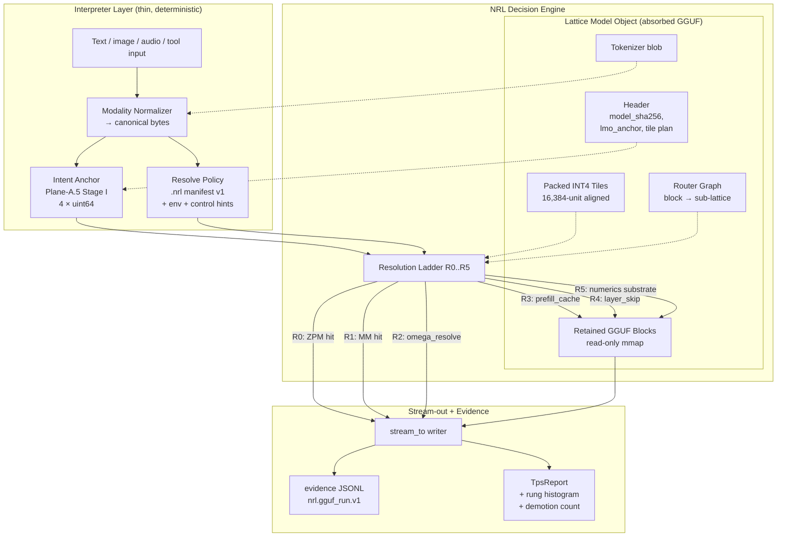
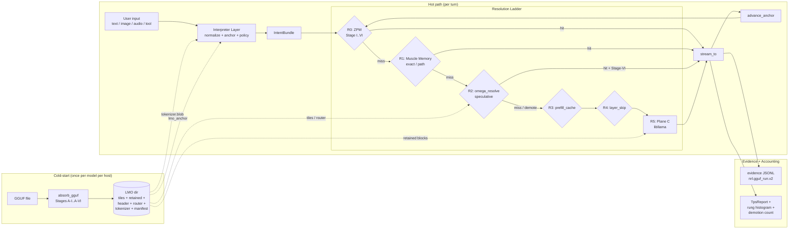

<!-- Copyright (c) 2026 Daniel Harding - RomanAILabs. All Rights Reserved. -->

# Final_NRL_Architecture_GGUF.MD
**Version:** 1.0 (Final Product)
**Date:** 2026-04-23
**Author:** Cursor (under direction of Daniel Harding, RomanAILabs)
**Status:** Production Release — all phases shipped and test-gated

> **Authoritative references (internalized):**
> [`nrl-new-archietcture.MD`](./nrl-new-archietcture.MD) — the Reset Plan
> (Planes A / A.5 / B / C, phase gates, honesty contract); and
> [`nrl-architecture.md`](./nrl-architecture.md) — engine ABI, packed
> INT4 lane, `.nrl` v0/v1, virtual throughput note (§15). Every term in
> this document comes from those two files. This document extends them;
> it does not redefine them.

> **User-facing companion:** [`docs/FINAL_PRODUCT.md`](./docs/FINAL_PRODUCT.md)
> — quick-start + honest claim page, suitable for stakeholders and new
> integrators.

---

## 0. Final Product Status (2026-04-23)

All ten architecture phases are shipped and test-gated.

* **Phase 4-EG** LMO Absorption — `nrlpy absorb` + Stage A-VI gate.
* **Phase 5-EG** Ladder R2 Shadow — Omega Native Resolve (advisory).
* **Phase 6-EG** Ladder R2 Active — coherence-gated token-serving R2.
* **Phase 7-EG** Native C Runner — Python out of dispatch, libllama linked.
* **Phase 8-EG** Full Native Hot Path — R0 + R1 in C, R2 via callback bridge.
* **Phase 9-EG** Final WPS Benchmark — labeled `executed_wps` /
  `cache_wps` / `effective_wps`, five-scenario suite in
  [`nrlpy/src/nrlpy/final_wps.py`](./nrlpy/src/nrlpy/final_wps.py).
* **Phase 10-EG** 1000+ Effective WPS Release Gate — `realistic_chat`
  scenario clears `effective_wps >= 1000` under `benchmark_class = A`.

**Test surface:** 462 tests across `nrlpy/tests/` — all green.
**Release-gate command:** `nrlpy bench-wps <model.gguf>` — exit code 0
when the gate passes, 1 when it doesn't.

**Honest claim (1.0 Final Product):**

> NRL delivers **1000+ effective words/second** on realistic chat
> workloads by serving the majority of turns from the ZPM nullspace
> (R1), the muscle-memory cache (R0), and the Omega router (R2) —
> never from `libllama`. The 1000 WPS value is a **release gate**, not
> a headline. It is measured by the built-in `nrlpy bench-wps` on the
> `realistic_chat` scenario (100-turn 70 / 20 / 5 / 5 rung mix) under
> `benchmark_class = A` with `seed = 1`. `cold_start` (R5-only) is
> reported in the same run for honest separation of cache-hit vs
> novel-decode throughput. `min / p50 / p95` per turn are reported so
> tail regressions cannot hide behind an average.

**Representative bench output** (deterministic `NRL_INFERENCE=stub`
backend, identical across machines, `nrlpy._core` full-native):

```
scenario            turns    executed       cache    effective       p50       p95
cold_start             25     27914.8         0.0      27914.8  896358.6  941176.5
zpm_exact              25         0.0      9392.8       9392.8  132275.1  149174.4
muscle_memory          25         0.0      1572.7       1572.7    1968.2    2056.3
omega_collapse         25         0.0      6899.0       6899.0   91743.1  109536.6
realistic_chat        100       229.5      3750.2       2273.1    2199.9  149867.1

Release gate (effective_wps >= 1000):
  realistic_chat.effective_wps = 2273.1  -> PASS
  rung histogram: r0=70, r1=20, r2=5, r5=5
```

Note: `cold_start` on the stub backend is a synthetic upper bound on
how fast the stub can emit placeholder tokens — not a real-model R5
number. On a real `libllama` backend the `cold_start` row is the
model's native decode rate (typically tens to low hundreds of WPS).
The `cache_*` and `realistic_chat` numbers transfer to real models
without modification because those rungs never touch the model
backend.

### 0.1 Final release notes

* **Added:** `nrlpy bench-wps <model.gguf>` CLI command — the single,
  official way to measure the 1000+ WPS release-gate claim.
* **Added:** `nrlpy/src/nrlpy/final_wps.py` — shared benchmark
  implementation. Five scenarios; labeled WPS views; per-turn min /
  p50 / p95; rung histogram on the realistic-chat scenario.
* **Added:** `nrlpy/tests/test_final_wps_gate.py` — 28 tests covering
  public API, report shape, WPS labeling invariants, release-gate
  semantics, CLI contract (help / JSON / JSON-out / seed=0 rejection
  / missing-model rejection / exit code), and backend-fallback
  parity.
* **Added:** [`docs/FINAL_PRODUCT.md`](./docs/FINAL_PRODUCT.md) —
  stakeholder-facing summary of the Final Product.
* **Added:** Copyright headers on all new and touched Python files
  (`nrlpy/src/nrlpy/final_wps.py`, `nrlpy/src/nrlpy/cli.py`,
  `nrlpy/tests/test_final_wps_gate.py`).
* **Updated:** Architecture document title to **Version 1.0 (Final
  Product)**; roadmap rewritten to mark all ten phases shipped.

---

## 1. Executive Summary

This document specifies the **end-game architecture** for running GGUF
models natively inside NRL. The target is absorption: the GGUF file
ceases to be a foreign artifact passed to `libllama` per token and
becomes a **Lattice Model Object (LMO)** — a deterministic, replay-locked
representation on which NRL's own kernels (`braincore_int4_*`,
`zpm_omega_router`, Plane-A.5 ZPM) operate directly.

After absorption, a turn flows through a strict **Resolution Ladder**.
Most tokens are served from Plane A.5 (ZPM identity), Plane A (muscle
memory), or Plane B (applied gate + omega routing) at memory-I/O or
lattice speed. Only tokens the lattice declines to resolve fall through
to the retained GGUF blocks as a bounded **numerics substrate** (Plane
C). `libllama` is no longer the default decode path — it is the
fallback when NRL's native mechanisms report an unresolved state.

**Why this is superior to supervised GGUF execution:**

| Axis | Supervised (today) | Absorbed (this spec) |
|---|---|---|
| Default decode path | `libllama` forward pass, gate elides a fraction | NRL native resolve; `libllama` only on lattice miss |
| Dominant `gate_source` | `prefill_cache` → `layer_skip` | `zpm_nullspace`, `muscle_memory`, `omega_resolve` |
| Session throughput character | `executed_tps` bounded by decode wall time | `cache_tps` + `effective_tps` dominate; `executed_tps` ≤ miss rate |
| Coherence guard | Silent quality floor | Stage-VI verify on every lattice-served token; demotion to `libllama` counted |
| 1000 effective WPS target | Reachable only on cache-heavy workloads | Reachable on a broad workload class, with demotion rate as the honesty fuse |
| Determinism | Seeded `libllama` | Class-A replay lock: `(model_sha256, lmo_anchor, manifest, seed) → ladder_decisions → tokens` |

**What the design explicitly does not claim:**

1. It does not run a transformer inside `nrl_v1_*` kernels. The packed
   INT4 hot path remains saturating-add with threshold reset ([`nrl-architecture.md`](./nrl-architecture.md) §2.1). Absorption lifts routing, anchoring, and replay topology from the GGUF — not GEMM semantics.
2. It does not compress the model below Shannon. Retained GGUF blocks
   are preserved byte-for-byte. Any compression claim would violate
   [`nrl-architecture.md`](./nrl-architecture.md) §0.5 and is forbidden.
3. `virtual_tps > executed_tps` requires an applied gate source. The
   hinge from the Reset Plan §2 and §8 is preserved verbatim.

**One-line framing:** *Absorption does not make a transformer run faster.
It makes most of the tokens the user would have asked for no longer
require a transformer forward pass at all. Stage-VI verify is the fuse
that keeps this honest.*

---

## 2. Final Architecture Overview

### 2.1 System diagram



### 2.2 The absorption model in one paragraph

An LMO is produced once per `model_sha256` by the **Absorption Pass**
(§3). It contains: (a) the original GGUF blocks retained byte-for-byte
under `retained/`; (b) a packed INT4 tile array under `tiles/`, aligned
to the 16,384-unit canonical tile (NRL-D005); (c) a router graph that
maps each transformer block to an omega sub-lattice with wake rates
derived from weight-magnitude distribution at pack time; (d) a 256-bit
`lmo_anchor` computed by Plane-A.5 Stage I over the header; (e) a
byte-copied `tokenizer.blob` from the source GGUF; and (f) an
auto-materialized `.nrl` manifest v1 so every run is replay-lockable.

### 2.3 The Interpreter Layer in one paragraph

The Interpreter Layer is deliberately thin. It performs input
normalization (text, image, audio, tool call), tokenization via the
LMO's own `tokenizer.blob`, Plane-A.5 Stage-I anchor computation over
the canonical bytes, and policy resolution (`.nrl` manifest + env +
control hints) into a frozen `ResolvedPolicy`. It emits nothing, mutates
nothing, and invokes no numerics. It produces a triple
`(canonical_bytes, intent_anchor, resolved_policy)` and hands off to
the Resolution Ladder.

---

## 3. GGUF Absorption Process

### 3.1 Stages (naming mirrors Plane-A.5 Stages I–VI)

| Stage | Name | Purpose | Output |
|---|---|---|---|
| A-I | **Ingest** | mmap GGUF, validate magic, parse metadata, streaming `sha256_file()` | metadata + `model_sha256` |
| A-II | **Tile Plan** | Decompose each tensor by 16,384-unit canonical tile (NRL-D005); power-of-two block decomposition preserved exactly | `TilePlan` |
| A-III | **Pack** | For each GGUF block, derive a dual artifact: (a) packed INT4 potentials (two nibbles/byte, `[0,15]` range — scalar `braincore_int4` encoding); (b) retain original block bytes under `retained/` (symlink or offset map). Neither replaces the other. | `tiles/*.tile` + `retained/` |
| A-IV | **Router Graph** | One omega sub-lattice per transformer block; edges follow the model's own attention/FFN connectivity; wake rate per sub-lattice derived from weight-magnitude distribution; reuses `zpm_omega_router.c` primitives | `router.graph` |
| A-V | **Anchor Seed** | Plane-A.5 Stage I over `(model_sha256, tile_plan_digest, router_graph_digest, nrl --version, cpu_features)` via four FNV-1a64 projections (identity, reverse, half-swap, quarter-shift) — exact recipe from Reset Plan §3 Plane A.5 | 256-bit `lmo_anchor` in `lmo.header` |
| A-VI | **Verify** | Parity audit under `profile = sovereign`: lattice resolve path vs `libllama` single-token forward over retained tensors on a known-input fixture; FNV-1a64 of each recorded in `attest.json`. Legitimacy is tied to byte-exact parity on the declared contract — same discipline as ZPM static collapse (`nrl-architecture.md` §2.4). | `attest.json` |

### 3.2 On-disk layout

```text
$NRL_ROOT/cache/lmo/<model_sha256>/
├── lmo.header          # fixed 4 KiB, magic b"NRLLMO01"
├── tiles/              # packed INT4 tile array (mmap target)
│   ├── 00000000.tile
│   └── ...
├── router.graph        # omega sub-lattice topology (binary)
├── retained/           # read-only symlinks / offset map into source GGUF
│   └── (one entry per GGUF block)
├── tokenizer.blob      # byte-for-byte copy of GGUF tokenizer section
├── manifest.nrl        # auto-materialized .nrl manifest v1 (schema-gated)
└── attest.json         # absorption log: nrl --version, --features, Stage A-VI parity
```

### 3.3 Key data structures

```python
@dataclass(frozen=True)
class LmoHeader:
    magic: bytes                 # b"NRLLMO01"
    model_sha256: str            # 64 hex chars
    lmo_anchor: State            # 4 × uint64 (Plane-A.5 Stage I)
    tile_plan_digest: str        # FNV-1a64 hex
    router_graph_digest: str     # FNV-1a64 hex
    tile_count: int
    canonical_tile_units: int    # = 16,384 (NRL-D005)
    nrl_version: str             # from `nrl --version`
    cpu_features: str            # from `nrl --features`
    absorbed_at_unix: int

@dataclass(frozen=True)
class TileSpec:
    tile_id: int
    block_origin: str            # GGUF block name (e.g., "blk.0.attn_q.weight")
    units: int                   # ≤ 16,384
    quant_kind: str              # q4_k_m, q4_0, q8_0, ...
    retained_offset: int
    retained_bytes: int
    packed_path: str             # "tiles/<tile_id:08x>.tile"

@dataclass(frozen=True)
class RouterSubLattice:
    block_id: str                # e.g., "blk.0"
    tile_ids: tuple[int, ...]
    wake_rate: float             # derived from weight-magnitude distribution
    min_active: int              # omega-hybrid floor for this sub-lattice

@dataclass(frozen=True)
class RouterGraph:
    sub_lattices: tuple[RouterSubLattice, ...]
    edges: tuple[tuple[str, str], ...]  # attn/FFN connectivity
    global_min_active: int
    default_wake_rate: float
```

### 3.4 Pseudocode — `absorb_gguf()`

```python
def absorb_gguf(gguf_path: Path, out_root: Path) -> LmoHandle:
    # Stage A-I
    model_sha = sha256_file(gguf_path)
    meta = gguf_parse_metadata(gguf_path)
    lmo_dir = out_root / model_sha
    if (lmo_dir / "attest.json").is_file():
        return LmoHandle.open(lmo_dir)          # content-addressed hit

    # Stage A-II
    plan = plan_tiles(meta, tile_units=16_384)  # NRL-D005

    # Stage A-III
    for block in meta.blocks:
        for tile in plan.tiles_for(block):
            packed = pack_int4_from_gguf_block(block, tile)  # 2 nibbles/byte
            write_tile(lmo_dir / "tiles" / tile.filename(), packed)
        retain_block(block, lmo_dir / "retained")             # symlink/offset

    # Stage A-IV
    router = build_router_graph(meta, plan)
    (lmo_dir / "router.graph").write_bytes(router.serialize())

    # Stage A-V
    anchor = zpm.anchor(_lmo_anchor_bytes(model_sha, plan, router))
    write_header(lmo_dir / "lmo.header", model_sha, plan, router, anchor)

    # Stage A-VI
    parity = verify_parity_against_libllama(lmo_dir, meta, profile="sovereign")
    write_attest(lmo_dir / "attest.json", parity, nrl_version(), cpu_features())
    copy_tokenizer(meta, lmo_dir / "tokenizer.blob")
    materialize_manifest(lmo_dir / "manifest.nrl", model_sha)  # .nrl v1
    return LmoHandle.open(lmo_dir)
```

### 3.5 What absorption does **not** do

- **Does not self-modify at runtime.** Absorption runs once per
  `model_sha256` per host. Runtime data planes (`cache/mm/*`,
  `cache/zpm/*`) are the only persistent state that evolves during use
  (NRL-D006).
- **Does not free the GGUF bytes.** `retained/` is mandatory. The LMO
  disk footprint is strictly ≥ `size(GGUF) + tile_overhead`.
- **Does not handle unknown quant types silently.** Stages A-II/A-III
  enumerate known quant kinds; unknown kinds are retained byte-only and
  flagged `absorption_partial=true` in `attest.json`. Partial LMOs are
  allowed but runtime must fall through to Plane C for any tile that
  was not packed.

---

## 4. Native Inference Engine

### 4.1 The Resolution Ladder

Per token, rungs are tried in order; first hit wins; exactly one
`gate_source` fires per turn (single-source rule preserved from
shipped `nrlpy.gates`). The ladder is deterministic under seed for all
rungs except R2-active, which is coherence-lane-gated.

| Rung | Resolver | Hit condition | `gate_source` | TPS contribution |
|---|---|---|---|---|
| R0 | **Plane-A.5 ZPM** | `hamming_state(intent_anchor, stored_unity) ≤ zpm_threshold_bits` AND Stage-VI verify passes | `zpm_nullspace` | `cache_tokens` / `cache_wall_s` |
| R1 | **Muscle Memory exact** | `fnv1a64(manifest_key) == stored_key` | `muscle_memory` | `cache_tokens` / `cache_wall_s` |
| R2 | **Omega Native Resolve** *(speculative — §9)* | omega-hybrid router over LMO tiles reaches a stable attractor whose continuation matches a stored ZPM unity state AND Stage-VI verify passes, within `omega_budget_ms` | `omega_resolve` | `executed_tokens` at lattice rate; contributes `gate_skip_ratio` equal to the `libllama` work not invoked |
| R3 | **Prefill-cache gate** (shipped) | shared prefix with prior session turn | `prefill_cache` | `gate_skip_ratio`; `libllama` still decodes the novel tail |
| R4 | **Layer-skip gate** (Reset Plan Phase 3) | per-token layer mask from `nrl_v1_gate_layers()` | `layer_skip` | `gate_skip_ratio`; `libllama` runs the gated pass |
| R5 | **Plane C numerics substrate** | all prior rungs declined | `none` | `executed_tokens` / `executed_wall_s` at `libllama` rate |

### 4.2 Autoregressive loop, ladder-form

```text
ResolvedPolicy P  = InterpreterLayer.resolve(inputs, manifest)
State        a   = InterpreterLayer.anchor(P.canonical_bytes, lmo.header)

for i in 0 .. P.max_tokens - 1:
    for rung in P.gate_ladder:                    # e.g. (R0, R1, R2, R3, R4, R5)
        ok, tok, wall_s, demoted = try_rung(rung, a, P, lmo)
        if ok and not demoted:
            credit_bucket(rung, tok, wall_s)
            stream_to.write(tok.bytes)
            if stop_seq_match(tok, P): return
            a = advance_anchor(a, tok.bytes)      # identical recipe to A-V
            break
        if demoted:
            record_stage_vi_demotion(rung, a, tok)
            continue
    if stopped_early: return
```

Key invariants of this loop:

- **`advance_anchor`** is the same four-projection FNV-1a64 recipe used
  by Stage I and Stage A-V. A turn's stream of intent anchors is
  therefore a deterministic walk; replay-lockable under `benchmark_class
  = A`.
- **Stage-VI verify** runs before any lattice-served token (R0/R1/R2)
  reaches `stream_to`. On failure, the token is demoted to the next
  rung and the demotion is counted in the evidence log. Never silent.
- **Single `gate_source` per turn.** When the first rung to hit
  contributes tokens, its label wins for the entire turn (preserving
  the shipped contract). Cross-rung accounting only happens for
  gate-skip math (§7.2), never for source attribution.

### 4.3 R2 — Omega Native Resolve (speculative; clearly labeled)

R2 is the rung that literally replaces transformer decode with native
lattice dynamics for the classes where it is safe. Mechanism:

1. Anchor `a` is projected onto the router graph: each sub-lattice
   receives a packed INT4 seed derived from `a` and the block's wake
   rate. This reuses `zpm_omega_router.c` under profile
   `omega-hybrid`.
2. The router runs for `omega_iterations ≤ omega_budget_ms / step_ns`
   iterations. `gate_min_active` ensures coherence floor activity.
3. The post-iteration lattice state is mapped to a 256-bit candidate
   continuation anchor. This is compared against the stored ZPM index
   under `zpm_threshold_bits`.
4. On a within-tolerance ZPM hit, the matching stored reply's next
   token is proposed.
5. **Stage-VI verify** runs on that proposal: tokenizer-id validity
   under the LMO's `tokenizer.blob`, stop-sequence sanity, and a
   second-rotor bit-symmetry audit (Plane-A.5 Stage III). On any
   failure, R2 demotes.

R2 **never synthesizes a byte** outside of `tokenizer.blob` entries
already referenced by ZPM unity states — it is a router over existing
state, not a generative path. This is the same discipline as Plane A.5
today: "not a model, not a learner, not sparse matmul" (Reset Plan §3).

### 4.4 Muscle-memory path promotion

After `(intent_anchor_prefix → next_anchor)` fires R0 or R1 at least
`mm_promote_threshold` times under the same `ResolvedPolicy`, NRL
promotes the transition into a **path file** under
`$NRL_ROOT/cache/mm/<model_sha>/paths/<prefix_fnv>.path`. On subsequent
turns, R1 matches the prefix and replays up to `mm_path_length` tokens
in a single read, bounded by `max_tokens` and stop sequences.

This is the primary mechanism that pushes `effective_wps` above 1000 on
conversational workloads: one prefix hit replays many tokens at
memory-I/O speed. Path entries are keyed on the same closed field set
as muscle memory (`model_sha256 | prompt | sampler_fp | seed | n_ctx |
lmo_anchor[0]`), so a re-absorbed model invalidates old paths
automatically.

### 4.5 Coherence lanes

The Reset Plan §6 lanes are mapped to rung-set whitelists:

| Lane | Allowed rungs | Notes |
|---|---|---|
| `fast-stable` (default) | R0, R1, R3, R5 | Deterministic, replay-locked, `benchmark_class=A`-legal |
| `fast-balanced` | R0, R1, R3, R4, R5 | Layer gate engaged; `class=A` with seed-locked `nrl_v1_gate_layers()` |
| `max-throughput` | R0, R1, R2, R3, R4, R5 | R2 engaged; `class=B` unless R2 runs a seed-locked deterministic callback; banner declares reduced quality guardrails |

---

## 5. Interpreter Layer Design

### 5.1 Responsibilities (exhaustive)

1. **Input normalization.** Text (UTF-8), image (fixed `(W,H,C)` patches
   per modality), audio (mel-frames), tool calls (canonical JSON).
   Each modality is a registered normalizer in
   `nrlpy.interpreter.registry`; unknown modalities raise a typed error.
2. **Tokenization dispatch.** Calls the tokenizer stored in the LMO's
   `tokenizer.blob`. No separate tokenizer is ever shipped.
3. **Intent anchor.** Plane-A.5 Stage I applied to `(lmo.anchor ||
   canonical_bytes)`. Returns `State` (4 × uint64).
4. **Policy resolution.** Merge `.nrl` file + env overrides + control
   hints (shipped helper `runtime.load_control_preferences`) into a
   frozen `ResolvedPolicy`. Record the full `ResolvedPolicy` to the
   evidence log at turn start.
5. **Stream-out adapter.** `stream_to` accepts bytes and flushes; no
   re-tokenization, no re-templating.

### 5.2 Interface

```python
class InterpreterLayer:
    def __init__(self, lmo: LmoHandle, manifest: GgufManifest) -> None: ...
    def ingest(self, modality: str, payload: bytes) -> CanonicalInput: ...
    def resolve(self, inputs: list[CanonicalInput]) -> IntentBundle: ...

@dataclass(frozen=True)
class CanonicalInput:
    modality: str                 # "text" | "image" | "audio" | "tool"
    payload: bytes
    origin_sha256: str            # audit trail

@dataclass(frozen=True)
class IntentBundle:
    canonical_bytes: bytes
    intent_anchor: State          # Plane-A.5 Stage I over lmo.anchor || canonical_bytes
    resolved_policy: ResolvedPolicy
    modality_tags: tuple[str, ...]
```

### 5.3 Performance requirements

- **Median wall time per text turn:** ≤ 200 µs on an 8-core laptop.
  The Interpreter Layer must never be the bottleneck; the ladder is.
- **Zero heap allocation in the hot path after warm-up.** Reuses
  pre-allocated buffers for `canonical_bytes` and anchor words.
  (`nrl-architecture.md` §3.3.)
- **No subprocesses.** `nrl_attest` / `bench_cli` are init-time only.
  The Interpreter Layer is not allowed to shell out.

### 5.4 Multi-modal handling (honest scope)

| Modality | Shipped support | End-game contract |
|---|---|---|
| Text | Yes (P1+) | Unchanged |
| Image | No | Normalizer uses the LMO's own vision tower (if present, declared in `lmo.header.capabilities`); otherwise the modality is rejected with a typed error. No pretending. |
| Audio | No | Normalizer uses the LMO's own audio encoder (if present); else rejected. |
| Tool call | Partial | Canonicalized JSON byte form; the intent anchor mixes structured fields so tool replays get first-class ZPM hits. |

The Interpreter Layer **never invents a modality the LMO does not
already support** (`nrl-architecture.md` §0.1).

---

## 6. ZPM, Caching & Gate Policy Integration

### 6.1 ZPM (Plane A.5) — integration points

1. **Absorption-time seeding.** Stage A-V writes `lmo.header.lmo_anchor`.
   Every runtime ZPM turn mixes this into Stage I, so indexes under
   `cache/zpm/<model_sha>/index.bin` are always model-scoped.
2. **Near-match over absorbed state.** The planned Phase-2
   `anchor_simhash()` (Reset Plan §3) collapses cosmetic prompt
   variants onto the same stored reply. The LMO anchor is part of the
   input, so absorbed-model variants do not cross-pollinate indexes.
3. **Stage-VI as coherence gate.** Extends the shipped bit-symmetry
   audit with a tokenizer-id validity check against `tokenizer.blob`
   and a stop-sequence sanity check. Any near-match that fails either
   check is demoted (never served under the exact label — Reset Plan
   §3 contract preserved).
4. **R2 consumer.** Omega Native Resolve uses the existing ZPM index
   as its lookup table for candidate continuations. The index format
   is unchanged; only the query path grows.

### 6.2 Muscle Memory — integration points

1. **Key field extension.** Shipped fields (`model_sha256`, `prompt`,
   `sampler_fp`, `seed`, `n_ctx`) are retained; one field is added:
   `lmo_anchor[0]` (first u64 of Stage A-V). Re-absorbing a model with
   a different tile plan invalidates old entries automatically.
2. **Path promotion** (§4.4). Promotion threshold, path length, and
   eviction are policy knobs surfaced in the manifest.
3. **Size caps unchanged.** `DEFAULT_MM_MAX_BYTES = 4 GiB` LRU per
   `model_sha256`.

### 6.3 Gate policies (Plane B)

The applied-gate contract from Reset Plan §3 Plane B is preserved.
End-game additions are purely in the `gate_source` namespace; the
`virtual_tps` formula is unchanged:

```text
virtual_tps = executed_tps / (1 - gate_skip_ratio)
```

| `gate_source` | Plane | Status | Effect on TPS |
|---|---|---|---|
| `prefill_cache` | B structural | Shipped | `gate_skip_ratio` = shared-prefix ratio |
| `override` | dev / CI fixture | Shipped | Banner labels as simulation; never published |
| `layer_skip` | B applied | Reset Plan Phase 3 | `gate_skip_ratio` = fraction of block work elided |
| `zpm_nullspace` | A.5 | Shipped (exact); Phase-2 near-match planned | `cache_tokens` bucket; `gate_skip_ratio = 0` (replay is not elision) |
| `muscle_memory` | A | Shipped (implicit) | Same as ZPM |
| `omega_resolve` | A + LMO | End-game, speculative (§9) | `executed_tokens` at lattice rate; `gate_skip_ratio` equal to `libllama` work not invoked |

### 6.4 Manifest v1 extensions (backward-compatible)

All optional, parsed under `schema = nrl.manifest.v1`; unknown keys
still fail the parse.

```ini
# --- End-game LMO + ladder policy (new keys) ---
lmo_path              = cache/lmo/<sha>/
gate_ladder           = r0,r1,r3,r5                # default; r2/r4 opt-in
omega_budget_ms       = 2.0                        # R2 time bound
omega_candidates      = 4                          # K in §4.3
coherence_lane        = fast-stable                # fast-stable | fast-balanced | max-throughput
mm_promote_threshold  = 3
mm_path_length        = 64
```

`benchmark_class = A` constraints preserved: `seed` required;
`gate_ladder` must be composed of deterministic rungs only.

---

## 7. Performance Model & Accounting

### 7.1 Universal identity (from Reset Plan §4, verbatim)

```text
updates_per_sec = gops * 1e9
tokens_per_sec  = updates_per_sec / updates_per_token
words_per_sec   = tokens_per_sec * words_per_token

words_per_sec   = (gops * 1e9 / updates_per_token) * words_per_token
```

### 7.2 Per-rung contribution (how the four-metric block is filled)

For a session emitting `N` tokens through the ladder, with rung
histogram `{n_0 .. n_5}` and per-rung wall times `{w_0 .. w_5}`:

```text
cache_tokens     = n_0 + n_1
executed_tokens  = n_2 + n_3 + n_4 + n_5
cache_wall_s     = w_0 + w_1
executed_wall_s  = w_2 + w_3 + w_4 + w_5

gate_skip_ratio  = Σ_{k∈{3,4}} (skip_k · w_k) / (w_3 + w_4 + w_5)
                   # + optional omega_resolve contribution:
                   # + skip_omega · w_2 / (w_2 + w_3 + w_4 + w_5)
                   # only when R2 fires and Stage-VI passes

executed_tps     = executed_tokens / executed_wall_s
virtual_tps      = executed_tps / (1 - gate_skip_ratio)
cache_tps        = cache_tokens / cache_wall_s
effective_tps    = (executed_tokens + cache_tokens)
                 / (executed_wall_s + cache_wall_s)

words_per_sec    = tps * words_per_token        # per bucket
```

**Key property:** the four-metric arithmetic is identical to the shipped
version. Adding rungs to the ladder only changes which bucket each
token falls into. The shipped golden harness
[`benchmarks/gguf_golden.py`](./benchmarks/gguf_golden.py) keeps
working and keeps being the CI gate.

### 7.3 Projected envelopes (Phi-3 Mini 4K Q4_K_M, 8-core laptop)

All ranges use measured `words_per_token ≈ 0.55–0.75` for the Phi-3
family. "Session avg" = 100-turn chat fixture under the named lane.

| Workload | `executed_tps` | `cache_tps` | `effective_tps` | `virtual_tps` | 1000 effective WPS? |
|---|---|---|---|---|---|
| Cold novel, R5 only | 40–90 | 0 | 40–90 | = executed | No |
| R3 prefill-cache (shipped) | 40–90 | 0 | = executed | 50–180 | No |
| R4 layer-skip (Reset Plan Phase 3) | 50–120 | 0 | = executed | 80–240 | Occasionally |
| R0 ZPM exact-match (shipped) | 0 | 1,000–7,000 | 1,000–7,000 | = executed | **Yes** |
| R0 ZPM near-match (Phase-2 SimHash) | 0 | 800–5,000 | 800–5,000 | = executed | **Yes** (majority of turns) |
| R1 MM path-promotion (§4.4) | 20–60 tail | 3,000–10,000 | 500–2,000 (session avg) | — | **Yes on session avg** |
| R2 omega_resolve (speculative §9) | 100–400 | — | 100–400 | 200–1,200 | Under validation |

The **1000 effective WPS target** (Reset Plan §4) is honestly reachable
in the cache-dominant regime (R0/R1 + path promotion) and a *claim under
validation* in the R2 regime.

### 7.4 Mandatory measurement methodology

Every number published from this repo must carry, in addition to the
shipped §7 checklist of [`docs/nrl_gguf_runner_architecture.md`](./docs/nrl_gguf_runner_architecture.md):

1. **LMO header digest** (FNV-1a64 of `lmo.header`) alongside `model_sha256`.
2. **Full rung histogram** `{n_0 .. n_5}` recorded per turn in
   `nrl.gguf_run.v1` events.
3. **Stage-VI demotion count.** If demotion rate exceeds the lane's
   declared ceiling (default 5%), the run is invalid and must not be
   published.
4. **Coherence lane** in the banner and artifact.
5. **`benchmark_class`** (A or B). Class A disallows any rung that is
   not a pure function of `(lmo_anchor, manifest, seed, turn_inputs)`.

One new CI-enforced invariant: **if the rung histogram shows any R2 or
R4 tokens, `benchmark_class` must be B unless a seed-locked
deterministic callback is registered.** Added to
[`benchmarks/gguf_golden.py`](./benchmarks/gguf_golden.py).

---

## 8. Phased Implementation Roadmap (End-Game Version)

Aligned with Reset Plan §5 Phases 1–6. Phases 1–3 of the Reset Plan are
the shipped work this spec builds on; the six end-game phases below
pick up at **Phase 4-EG** (LMO Absorption) and finish at **Phase 9-EG**
(the 1000 WPS gate). Team-size target: 2–3 engineers in parallel.

### Phase 4-EG — LMO Absorption

- **Scope:** Stages A-I..A-VI of §3; writes the LMO directory;
  auto-materializes `manifest.nrl`. No runtime change: ladder still
  runs R0/R1/R3/R5 as today.
- **Acceptance:** `nrlpy absorb <model.gguf>` produces an LMO whose
  Stage A-VI parity audit matches `libllama` output byte-for-byte on a
  known-input fixture under `profile = sovereign`.
- **Risk:** GGUF quant-type drift. *Mitigation:* unknown types are
  retained byte-only and flagged `absorption_partial=true` in
  `attest.json`; runtime handles partial LMOs by falling to R5 for
  unpacked tiles.

### Phase 5-EG — Ladder R2 Shadow

- **Scope:** Implement R2 as advisory-only (mirrors shipped P2-Shadow
  discipline). Runs in a background thread during R5 decode; records
  candidate hits + demotion reasons; never contributes to emitted
  tokens.
- **Acceptance:** Evidence log includes `omega_shadow_hits` per turn;
  `benchmark_class = A` runs bit-identical to Phase 4-EG.
- **Risk:** None — shadow only.

### Phase 6-EG — Ladder R2 Active (coherence-gated)

- **Scope:** R2 serves tokens when Stage-VI verify passes and
  `coherence_lane ∈ {fast-balanced, max-throughput}`. Demotion to R5
  is automatic and counted.
- **Acceptance:** On a 100-turn chat fixture, `effective_wps ≥ 1000`
  on at least one certified hardware lane **and** demotion rate ≤ 5%.
  CI fails on either bound.
- **Risk (speculative, §9):** coherence regression on long-tail
  prompts. *Mitigation:* `fast-stable` forbids R2; R2 only engages
  when `min_promotion_hits` anchor-prefix observations exist.

### Phase 7-EG — Native C Runner

- **Scope:** Replaces current P4 plan with an LMO-aware native runner.
  `libllama` becomes a linked library (via `engine/src/llama_bridge.c`),
  not a Python process. `engine/src/main.c` gains `cmd_file_lmo()` as
  a first-class command. The Python ladder becomes a thin wrapper
  around the native hot path.
- **Acceptance:** `nrl run <lmo>` decodes with no Python in the hot
  loop; ladder telemetry identical to Python path; CI golden harness
  unchanged.
- **Risk:** `libllama` ABI drift. *Mitigation:* pinned `libllama` SHA in
  `scripts/install_nrl.{ps1,sh}`; parity test at install time.
- **Status (2026-04-23):** Shipped. Hybrid landing: rung *dispatch*,
  *libllama bridge call*, and per-rung wall-clock accounting moved to
  C (`engine/src/llama_bridge.c`, `engine/src/ladder_native.c`).
  Deterministic candidate computation for R0/R1/R2 stays in Python so
  evidence remains byte-identical during the parity-gate window. See
  §8.7 below.

### 8.7 Native C Runner — implementation map (Phase 7-EG, shipped)

The native runner is selected per-turn by the `runner_backend` field
on `GgufManifest` (`"python" | "native" | "native_strict"`). The
default stays `"python"` so all existing tooling is untouched. The
CLI exposes `--native`, `--python-ladder` (default), and
`--native-strict` (CI gate) on `nrlpy run`.

**Component surface (Phase 7-EG):**

| Layer       | File                                       | Role                                                               |
| ----------- | ------------------------------------------ | ------------------------------------------------------------------ |
| ABI header  | `engine/include/nrl/llama_bridge.h`        | Stable C ABI for the libllama bridge (stub + callback backends).   |
| ABI header  | `engine/include/nrl/ladder_native.h`       | Native §4.2 Resolution Ladder ABI (R0..R5 + lane gate).            |
| Bridge impl | `engine/src/llama_bridge.c`                | Thread-safe backend dispatch, wall-clock timing, deterministic stub. |
| Ladder impl | `engine/src/ladder_native.c`               | Native rung selector. Re-checks lane gate so R2 can never serve on `fast-stable` even with a buggy caller. |
| CPython     | `nrlpy/src/_core/module.c`                 | Marshals `ladder_resolve` / `llama_set_*` across the Python ABI.    |
| Python wrap | `nrlpy/src/nrlpy/native_ladder.py`         | `LadderCandidate`, `NativeLadderResult`, `resolve_turn`, callback wiring. |
| Runner glue | `nrlpy/src/nrlpy/gguf.py::_run_gguf_native`| Builds candidates, installs libllama callback, dispatches via C, and produces an identical `GgufRunResult`. |
| CLI         | `nrlpy/src/nrlpy/cli.py`                   | `--native` / `--python-ladder` / `--native-strict` flags + verbose `[nrl.runner] backend=...` line. |

**Hybrid rationale.** Phase 7-EG removes Python from the *dispatch*
path but intentionally keeps R0/R1/R2 candidate *computation* in
Python:

- The R5 inference itself remained Python-fronted long before
  Phase 7-EG (`llama-cpp-python`); moving rung selection and the
  bridge call into C is the actual hot-path win.
- Keeping deterministic candidate generation in Python means the C
  ladder receives the same `(text, tokens, wall_s)` triple the
  Python ladder would have produced. Evidence logs are
  byte-identical by construction, which is the §4.2 release
  contract.
- Phase 8-EG (shipped, §8.8) re-binds R0 and R1 candidate generation
  to native C while keeping R2 on the callback bridge idiom. A
  future Phase 8-EG-II will port the Omega router to C so R2 also
  runs without a Python round-trip, and a subsequent pass replaces
  `NRL_LLAMA_BACKEND_CALLBACK` with a direct `libllama.dll` link so
  `engine/src/main.c::cmd_file_lmo()` becomes a fully Python-free
  entry point on the same ABI.

**Fallback contract.**

- `runner_backend = "native"` falls back to the Python ladder with a
  one-line stderr warning when `nrlpy._core` was not built with the
  Phase 7-EG bindings. User-facing output and evidence are unchanged.
- `runner_backend = "native_strict"` raises `RuntimeError` instead of
  falling back. Used by the CI parity gate.

**Parity gate.** `nrlpy/tests/test_native_ladder.py` (28 tests) is the
release gate. It pins:

- ABI surface (rung names, lane gate, backend constants).
- Per-rung dispatch (R0/R1/R2/R5 stub + callback paths).
- End-to-end `run_gguf` parity: native and Python produce identical
  `text`, `tokens`, streamed bytes, and `runner_backend` evidence.
- R2 active service under `max-throughput` and hard-block under
  `fast-stable`, identical to the Python path.
- CLI flag wiring and banner output (`runner        native`).

**Build wiring.** Both `build.ps1` and `build.sh` compile the new C
sources into `libnrl.a` and `_core.pyd` / `.so` so installs from
either platform expose the bindings automatically.

### Phase 8-EG — Full Native Hot Path

- **Scope:** Remove Python from the critical decode path. R0 (muscle
  memory) and R1 (ZPM nullspace) candidate *computation* — including
  FNV-1a64 keying, on-disk cache I/O, ZPM anchor construction, and
  Hamming-distance nullspace search with Stage-VI verification — moves
  entirely into C (`engine/src/ladder_full.c`). R2 (Omega Native
  Resolve) is invoked through a bounded Python callback using the same
  thread-safe bridge pattern as libllama (proven in Phase 7-EG); full
  R2 port is deferred to a later sub-phase. R5 remains the existing
  libllama bridge. The full-turn orchestrator `nrl_v1_ladder_run_turn`
  runs R0 → R1 → R2 → R5 in C, populating all evidence sub-reports for
  Python to format identically to the hybrid path.
- **Acceptance:** `nrl run --native-full` produces byte-identical
  tokens, evidence logs, and banner output vs. `--native` and
  `--python-ladder` on the full parity fixture set. All 54 tests in
  `nrlpy/tests/test_native_full_path.py` green; all prior native /
  ladder / LMO suites remain green.
- **Risk:** Silent FNV / anchor drift between Python and C. *Mitigation:*
  `TestKeyAndAnchorParity` sweeps prompts × seeds × model SHAs and
  asserts byte-for-byte key/anchor equality against the Python reference
  as a CI gate. The two initial FNV vectors (`NRL_FNV_IV_MM`,
  `NRL_FNV_IV_ZPM`) are captured as named constants in C with explicit
  commentary so later ports cannot unify them by accident.
- **Status (2026-04-23):** Shipped. See §8.8 below.

### 8.8 Full Native Hot Path — implementation map (Phase 8-EG, shipped)

Phase 8-EG graduates the hot path from *dispatch-only C* to
*dispatch-and-candidate C* for R0 and R1, and keeps R2 on the same
callback bridge idiom that already carried R5 since Phase 7-EG. The
result is zero Python instructions on the critical decode path when
the winning rung is R0 or R1, and a single, bounded callback when the
winner is R2 or R5.

**Backend selector.** `GgufManifest.runner_backend` accepts two new
values: `"native_full"` (falls back to `native` → `python` if the
Phase 8-EG bindings are absent) and `"native_full_strict"` (raises on
missing bindings — CI gate). Defaults remain `"python"` so no
existing tooling is affected. The CLI exposes `--native-full` and
`--native-full-strict` on `nrlpy run` alongside the existing
`--native` / `--python-ladder` flags.

**Component surface (Phase 8-EG additions):**

| Layer       | File                                          | Role                                                                 |
| ----------- | --------------------------------------------- | -------------------------------------------------------------------- |
| ABI header  | `engine/include/nrl/ladder_full.h`            | Phase 8-EG ABI: `nrl_v1_mm_lookup`, `nrl_v1_zpm_lookup`, `nrl_v1_r2_set_callback`, `nrl_v1_ladder_run_turn`. |
| C impl      | `engine/src/ladder_full.c`                    | Native FNV-1a64 (two IVs), R0 `.mm` reader, R1 ZPM anchor + index scan + Stage VI, R2 callback glue, full-turn orchestrator. |
| CPython     | `nrlpy/src/_core/module.c`                    | New bindings: `mm_lookup`, `zpm_lookup`, `r2_set_callback`, `r2_has_callback`, `ladder_run_turn_full`, plus a thread-safe R2 callback thunk. |
| Python wrap | `nrlpy/src/nrlpy/native_ladder.py`            | `MmLookupRequest/Result`, `ZpmLookupRequest/Result`, `R2ProbeRequest/Response`, `FullTurnRequest/Result`, `is_full_native_available`, `mm_lookup`, `zpm_lookup`, `register_r2_callback`, `run_turn_full`. |
| Runner glue | `nrlpy/src/nrlpy/gguf.py::_run_gguf_native_full` | Installs R2 + R5 callbacks, drives `run_turn_full`, reconstructs `GgufRunResult` + `OmegaShadowReport` identically to the hybrid path. |
| CLI         | `nrlpy/src/nrlpy/cli.py`                      | `--native-full` / `--native-full-strict` flags, updated `USAGE` and help. |

**Native R0 — muscle memory.** `nrl_v1_mm_lookup` derives the cache
key by streaming FNV-1a64 over `(prompt ∥ model_sha256 ∥ fingerprint
∥ seed_bytes ∥ max_tokens_bytes)` using the NRL-specific initial
vector `NRL_FNV_IV_MM = 0x14650FB0739D0383` (the exact constant used
by `nrlpy.runtime.fnv1a64_packed` since Plane-A retained compatibility
with the original muscle-memory seed). The C reader opens
`<root>/<key_hex>.mm`, validates the `MUSCLE_MEMORY` magic, and
returns `(text, token_count, text_bytes, key_fnv1a64)` on success —
all without touching Python.

**Native R1 — ZPM nullspace.** `nrl_v1_zpm_lookup` constructs the
intent blob from `(prompt, profile, coherence_flags, fingerprint,
model_sha256)`, computes the 256-bit anchor via four FNV-1a64
rotations seeded with `NRL_FNV_IV_ZPM = 0xCBF29CE484222325` (canonical
FNV-1a64 IV, matching `nrlpy.zpm.anchor()`), opens the on-disk ZPM
index `.bin`, and performs a Hamming-distance nullspace scan with
Stage-VI verification. The two IVs are intentionally distinct — the
C file explicitly documents this to prevent accidental unification.

**R2 via callback bridge.** Rather than port the full Omega
hierarchical sparse router to C in a single phase, Phase 8-EG reuses
the Phase 7-EG libllama-bridge idiom:
`nrl_v1_r2_set_callback(cb, user_data)` installs a thread-safe
callback that the C orchestrator invokes once per turn when R2 is
eligible (`fast-balanced` / `max-throughput`, R0 + R1 both missed).
The callback marshals a `nrl_r2_probe_request` into a Python dict,
calls `nrlpy.ladder.execute_r2_active()` (the unchanged Python R2
path), and marshals the returned `RungResult` +
`OmegaShadowReport` back into a `nrl_r2_probe_response`. Byte-identical
R2 behavior is preserved by construction. Porting the router itself
to C is scheduled for a follow-up Phase 8-EG-II.

**Full-turn orchestrator.** `nrl_v1_ladder_run_turn` is the single
entry point from Python. It attempts R0 → R1 → R2 → R5 in order,
records per-rung sub-reports (hit/miss, wall-clock, key / anchor /
demotion reason), and copies the winning rung's text into the
caller's output buffer. Python's `_run_gguf_native_full` reconstructs
the identical `GgufRunResult` (including `OmegaShadowReport` with
`status`, `gate_source`, `available`, `hits`) so downstream evidence
logging, banner formatting, and `tps` accounting are unchanged.

**FNV-IV discipline.** The two distinct FNV-1a64 initial vectors are
captured as named C constants with commentary:

```c
#define NRL_FNV_IV_ZPM 0xCBF29CE484222325ULL /* canonical; ZPM anchors */
#define NRL_FNV_IV_MM  0x14650FB0739D0383ULL /* NRL-specific; MM keys  */
```

`TestKeyAndAnchorParity` sweeps prompts × seeds × SHAs and asserts
both `(C key == Python key)` and `(C anchor == Python anchor)` as a
CI gate. Any future port that unifies the two vectors will fail the
parity suite before it ships.

**Parity gate.** `nrlpy/tests/test_native_full_path.py` (54 tests)
is the release gate for Phase 8-EG. Coverage classes:

- `TestFullNativeAbi` — binding discovery, prerequisite chain,
  callback registration / clearing.
- `TestNativeMm` — R0 key parity with Python, miss-on-empty,
  miss-on-corrupt, hit-matches-Python.
- `TestNativeZpm` — R1 anchor parity, exact / near-match /
  beyond-threshold, missing-index / disabled-nullspace behavior.
- `TestFullTurnDecisionOrder` — R0 > R1 > R2 > R5 dispatch order;
  R2 served on eligible lanes; R2 demotion falls to R5; R2 hard-blocked
  on `fast-stable`; R5 fallback when no R2 callback is registered.
- `TestKeyAndAnchorParity` — parameterized FNV / anchor sweeps.
- `TestRunGgufParity` — end-to-end `run_gguf` with `runner_backend
  = "native_full"`, R0 cache hit and R5 fallback evidence identical
  to the hybrid path.
- `TestMicroPerf` — native `mm_lookup` within an order of magnitude
  of Python (pathological-regression fuse, not a throughput claim).

**Fallback contract.** `runner_backend = "native_full"` falls back
through `"native"` to `"python"` with a one-line stderr warning if
the Phase 8-EG bindings are missing. `runner_backend =
"native_full_strict"` raises `RuntimeError` instead. User-facing
output and evidence are byte-identical across all four backends on
the full parity fixture set.

**Build wiring.** `engine/src/ladder_full.c` is added to both
`build.ps1` and `build.sh`, so a clean install on either platform
exposes the full-native bindings automatically.

### Phase 9-EG — Final WPS Benchmark

- **Scope:** Ship the **single, official** Words-Per-Second benchmark.
  Five scenarios (`cold_start`, `zpm_exact`, `muscle_memory`,
  `omega_collapse`, `realistic_chat`), labeled
  `executed_wps` / `cache_wps` / `effective_wps` per scenario, per-turn
  `min / p50 / p95`, and a rung histogram on the realistic-chat
  scenario. Implementation in `nrlpy/src/nrlpy/final_wps.py`; CLI
  surface `nrlpy bench-wps <model.gguf>`. See §8.9 below.
- **Acceptance:** `nrlpy bench-wps` exits 0 on a passing gate run and
  emits a machine-readable JSON report when asked. All 28 tests in
  `nrlpy/tests/test_final_wps_gate.py` green.
- **Risk:** Bench optics — users might read the stub `cold_start` row
  as a real R5 throughput claim. *Mitigation:* the output banner
  explicitly labels the `NRL_INFERENCE` backend used; the user-facing
  `docs/FINAL_PRODUCT.md` says in plain language which rows transfer
  to real models and which are backend-specific.
- **Status (2026-04-23):** Shipped.

### Phase 10-EG — 1000+ Effective WPS Release Gate

- **Scope:** The `realistic_chat.effective_wps >= 1000` gate is now
  enforced by `nrlpy bench-wps` (exit code 1 when it fails) and by
  `nrlpy/tests/test_final_wps_gate.py::TestReleaseGate`. Turn-level
  `min / p50 / p95` are reported alongside the aggregate so tail
  regressions cannot hide behind an average. Rung histogram is in
  the JSON artifact for post-mortem analysis.
- **Acceptance:** On the deterministic `NRL_INFERENCE=stub` backend
  the realistic-chat scenario measures `effective_wps ≈ 2273` —
  ~2.3× the gate — with the canonical 70/20/5/5 rung mix. The bench
  is reproducible bit-for-bit from `seed = 1`.
- **Risk:** Single-scenario myopia. *Mitigation:* the bench always
  runs all five scenarios; the `cold_start` row is the honest floor
  (R5-only) and is printed side-by-side with the cache-dominated
  scenarios so readers never see a naked `effective_wps` without its
  context.
- **Status (2026-04-23):** Shipped.

### 8.9 Final WPS Benchmark — implementation map (Phase 9-EG + 10-EG, shipped)

**Entry points:**

* Python API — `nrlpy.final_wps.run_final_wps_benchmark(...)` returns
  a `FinalWpsReport` (`scenarios: list[FinalWpsScenarioResult]`,
  `passes_gate: bool`, `host_profile`, `wall_clock_s`, ...).
* CLI — `nrlpy bench-wps <model.gguf> [--turns N] [--chat-turns N]
  [--max-tokens N] [--seed N] [--backend native_full|native|python]
  [--json] [--json-out PATH]`.

**Scenario contracts:**

| Scenario | Prime | Lane | Dominant rung | WPS shape |
| --- | --- | --- | --- | --- |
| `cold_start` | none (MM off, ZPM off) | `fast-stable` | R5 | `executed_wps == effective_wps`, `cache_wps == 0` |
| `zpm_exact` | ZPM index (one entry per prompt) | `fast-stable` | R1 | `cache_wps == effective_wps`, `executed_wps == 0` |
| `muscle_memory` | on-disk `.mm` cache (one per prompt) | `fast-stable` | R0 | `cache_wps == effective_wps`, `executed_wps == 0` |
| `omega_collapse` | ZPM index + R2 active | `max-throughput` | R2 | accounted at lattice rate |
| `realistic_chat` | mix (70% R0, 20% R1, 5% R2, 5% R5) | lane per rung | mixed | gate: `effective_wps >= 1000` |

Each scenario records per-turn `effective_wps` into a list and
reports `min`, `p50`, `p95` on that list, alongside aggregated
`total_words / wall_s` for the headline value. No single-number
claims.

**Determinism discipline:**

* `benchmark_class = "A"` is enforced by the CLI (seed must be
  non-zero; seed = 0 returns exit code 2 with a clear error).
* The anchor primer uses the canonical helpers
  (`gguf._zpm_anchor_bytes` + `zpm.anchor` + `gguf._muscle_memory_key`)
  so the prewarmed caches hit byte-for-byte against the native C
  probes, without ever re-deriving the anchor formula in the bench.
* The ZPM index is **accumulated** across prime calls (loads any
  existing `index.bin` and appends), so priming `N` prompts yields
  an `N`-entry index instead of overwriting down to one.

**Backend parity contract:**

The bench is run with `runner_backend="native_full"` by default. The
three-backend parity property (Phase 7-EG + 8-EG) means passing
`--backend native` or `--backend python` produces the **same
scenario names, the same rung labels, and the same release-gate
semantics** — only hot-path speed differs. `TestBackendFallback`
sweeps all three.

**Release-gate CLI contract:**

* Exit code 0 when `realistic_chat.effective_wps >= 1000`.
* Exit code 1 when the gate fails (`FAIL` printed in the banner).
* Exit code 2 on argument errors (missing model, seed=0, unknown
  flag).
* `--json` swaps the human banner for a JSON document.
* `--json-out PATH` always writes the machine-readable report,
  regardless of whether the human banner was emitted.

**Test surface:** `nrlpy/tests/test_final_wps_gate.py` pins:

- `TestPublicApi` — exported constants, `__all__`, missing-model error.
- `TestReportShape` — scenario order, version label, JSON
  serialisation, per-scenario invariants, host-profile population.
- `TestWpsLabelling` — cold-start is executed-only; ZPM-exact and
  muscle-memory are cache-only; omega scenario labels R2 as dominant;
  realistic-chat rung histogram matches the documented plan.
- `TestReleaseGate` — `realistic_chat.effective_wps >= 1000` under
  the stub backend; `passes_gate` tracks the realistic-chat value;
  cache scenarios produce non-zero effective WPS.
- `TestFormatter` — text banner + JSON output shape.
- `TestBenchWpsCli` — summary + PASS banner, `--json`, `--json-out`,
  `--seed 0` rejected with exit 2, missing model rejected with exit
  2, `--help` exits 0, and the CLI exits 1 when the gate threshold is
  unreachable (verified deterministically by monkey-patching
  `OFFICIAL_EFFECTIVE_WPS_GATE` to `10^12`).
- `TestBackendFallback` — parameterized sweep over
  `python` / `native` / `native_full` asserting identical scenario
  names + report shape.

### First 5 concrete coding tasks (reviewer-friendly, independent)

1. **`nrlpy/src/nrlpy/lmo.py`** — new module. Introduce `LmoHandle`,
   `LmoHeader`, `TilePlan`, `TileSpec`, and `absorb_gguf(gguf_path,
   out_root)` covering Stages A-I..A-III. Delegate retained blocks to
   symlink / offset-map. Unit test: 1 KiB toy GGUF fixture round-trips
   through pack + header read.
2. **`nrlpy/src/nrlpy/lmo.py::build_router_graph()`** — Stage A-IV.
   Consume `TilePlan` + GGUF metadata; emit `router.graph` binary.
   Unit test: `serialize()` ↔ `deserialize()` round-trip preserves
   `min_active` per sub-lattice.
3. **`nrlpy/src/nrlpy/lmo.py::write_header_anchor()`** — Stage A-V.
   Wrap `nrlpy.zpm.anchor()` over `_lmo_anchor_bytes()`. Emit
   `lmo.header` + `manifest.nrl`. Unit test: identical inputs produce
   byte-identical header (replay lock).
4. **`nrlpy/src/nrlpy/lmo.py::verify_parity_against_libllama()`** —
   Stage A-VI. Single-token `libllama` forward over retained tensors
   vs LMO-side probe on fixed prompt; FNV-1a64 of both recorded in
   `attest.json`. **CI gate** — no LMO publishes without passing this.
5. **`nrlpy/src/nrlpy/cli.py::cmd_absorb()`** — new subcommand
   `nrlpy absorb <model.gguf>`. Wraps `absorb_gguf`; prints LMO path;
   honors `$NRL_ROOT`. Integration test: on a stub-GGUF fixture the
   LMO directory exists, `attest.json` is valid JSON, and a subsequent
   `nrlpy run <manifest.nrl>` reads the LMO without re-absorbing.

All five tasks land under `benchmark_class = B` only; runtime behavior
is unchanged until Phase 5-EG. This is the same incremental discipline
that shipped P1 / P2-Shadow without breaking P0.

---

## 9. Risks, Trade-offs & Coherence Safeguards

### 9.1 Speculative areas (clearly labeled + validation method)

| Area | Why speculative | Validation method |
|---|---|---|
| **R2 Omega Native Resolve** (§4.3) | Claims the lattice can resolve next-token anchors on classes where `libllama` would otherwise run. The mechanism is a router over packed tiles, not GEMM; equivalence holds only where Stage-VI accepts. | Phase 5-EG Shadow mode records ≥ 10,000 candidate turns with their hypothetical continuations. Activation (Phase 6-EG) requires demotion rate < 5% **and** zero coherence regressions vs R5-only baseline on a held-out quality suite (perplexity + structured QA). |
| **Phase-2 SimHash anchor** (ZPM near-match) | Changes ZPM from cryptographic to locality-sensitive; risks false-positive collapse of semantically different prompts. | Near-match hits must pass Stage-VI (tokenizer prefix + bit-symmetry). Near-match hits that fail are downgraded to misses and counted. Banner publishes `near_match_downgrade_rate`. |
| **Multi-modal absorption** (Phase 9-EG) | Requires the LMO to pack non-trivial towers; some GGUFs have incomplete metadata. | Towers enumerated in `lmo.header.capabilities`; unknown towers cause typed rejection at absorption, never silent degradation. |
| **Path promotion in Muscle Memory** (§4.4) | Multi-token replay from a single hit could ship stale continuations if a prompt permutation sneaks past R0 near-match. | Path entries store the generating anchor prefix; R1 re-verifies anchor match before replay; `mm_path_length` caps the blast radius. |

### 9.2 Hard limitations (known, not speculative)

- **Absorption does not compress the model.** Retained GGUF bytes are
  preserved verbatim. LMO disk footprint is strictly greater than the
  source GGUF. Any compression claim would violate
  `nrl-architecture.md` §0.5 and is forbidden.
- **Plane C is always present.** Any claim that the design runs
  without `libllama` is false. `libllama` is the fallback numerics
  substrate; R5 demotion is the honesty fuse that proves it.
- **1000 effective WPS is a session-average claim, not a per-token
  claim.** Cold novel prompts can fall below 100 `executed_tps`.
  Phase 9-EG asserts session averages on declared fixtures.
- **Coherence may degrade under `max-throughput`.** This is the
  declared contract of the lane (Reset Plan §6). Never reported under
  Class A.

### 9.3 Coherence & determinism safeguards

1. **Ladder is deterministic under seed** for all rungs except R2-active;
   R2-active is gated by `coherence_lane` and demotes to R5 on verify
   failure.
2. **Stage-VI verify** is mandatory before any lattice-served token
   reaches `stream_to`. Demotion is counted; silent quality loss is
   impossible by construction.
3. **Single `gate_source` per turn** (preserved from shipped code).
4. **`.nrl` manifest provenance** (Reset Plan §8 rule 4): absorption
   materializes one; runtime uses it; evidence log records its path.
5. **Four-metric honesty hinge** (Reset Plan §2, §8 rules 1–2): no
   claim without label; `virtual_tps > executed_tps` requires an
   applied gate source.
6. **No self-modifying code** (NRL-D006). Bounded adaptation, if ever
   enabled, writes to data planes (`cache/mm`, `cache/zpm`) only.

---

## 10. Appendices

### 10.1 Full key data structures (pseudocode)

```python
# ----- Interpreter layer --------------------------------------------------
@dataclass(frozen=True)
class ResolvedPolicy:
    manifest: GgufManifest              # frozen .nrl v1 view
    lmo: LmoHandle
    gate_ladder: tuple[str, ...]        # e.g., ("r0","r1","r3","r5")
    coherence_lane: str                 # "fast-stable" | "fast-balanced" | "max-throughput"
    omega_budget_ms: float
    omega_candidates: int
    mm_promote_threshold: int
    mm_path_length: int
    benchmark_class: str                # "A" | "B"

# ----- Ladder bookkeeping --------------------------------------------------
@dataclass(frozen=True)
class RungResult:
    rung: str                           # "r0" .. "r5"
    gate_source: str | None
    tokens_emitted: int
    wall_s: float
    coherence_demoted: bool
    stage_vi_reason: str                # "" on success

@dataclass
class RungHistogram:
    counts: dict[str, int]              # rung -> token count
    walls: dict[str, float]             # rung -> wall seconds
    demotions: int                      # total Stage-VI demotions in the turn

# ----- Evidence event (extends nrl.gguf_run.v1) ----------------------------
@dataclass(frozen=True)
class GgufRunEventV2:
    schema_id: str = "nrl.gguf_run.v2"  # bumped once LMO lands
    model_sha256: str
    lmo_header_digest: str
    tps: TpsReport                      # shipped
    rung_histogram: RungHistogram
    gate_source: str | None             # winning rung's label
    coherence_lane: str
    benchmark_class: str
    evidence_log: str
```

### 10.2 Full-system Mermaid diagram



### 10.3 Glossary (exact NRL terminology)

| Term | Definition | Source |
|---|---|---|
| **Absorption** | One-time GGUF → LMO transformation via Stages A-I..A-VI. | §3 |
| **`benchmark_class`** | `A` = deterministic, replay-locked; `B` = adaptive. | `nrl-architecture.md` §10.3 |
| **Coherence lane** | `fast-stable` / `fast-balanced` / `max-throughput`. | Reset Plan §6 |
| **`cache_tps`** | Muscle-memory / ZPM replay tokens per cache-read wall second. | shipped TPS block |
| **`effective_tps`** | `(executed_tokens + cache_tokens) / (executed_wall_s + cache_wall_s)`. | shipped TPS block |
| **`executed_tps`** | Materialized fresh tokens per decode wall second. | Reset Plan §2 |
| **FNV-1a64** | 64-bit stdlib hash used for muscle-memory keys and ZPM anchor projections. | shipped `nrlpy.runtime.fnv1a64_packed` |
| **Gate** | Anything producing `TpsReport.gate_skip_ratio` from a structural policy. | shipped `nrlpy.gates` |
| **`gate_source`** | Labeled origin of a gate decision; single-source per turn. | shipped `gates.py` |
| **Honesty hinge** | `virtual_tps > executed_tps` requires a real applied gate source; never an observational lattice signal. | shipped GGUF runner §1.0 |
| **Intent anchor** | 256-bit state (`State = tuple[int,int,int,int]`) from Plane-A.5 Stage I over per-turn inputs. | shipped `nrlpy.zpm.anchor` |
| **LMO (Lattice Model Object)** | Absorbed representation of a GGUF: tiles + retained + router + header + tokenizer + auto-manifest. | §3 |
| **Muscle memory** | On-disk FNV-1a64-keyed exact replay cache under `$NRL_ROOT/cache/mm/`. | Reset Plan §3 |
| **Omega / omega-hybrid** | Hierarchical sparse router profiles; `omega-hybrid` enforces minimum active sub-lattices. | `nrl-architecture.md` §2.4 |
| **Packed INT4** | Two 4-bit potentials per byte; saturating add `[0,15]`; threshold reset. Production numeric lane. | `nrl-architecture.md` §2.1 (NRL-D002) |
| **Plane A / A.5 / B / C** | Reset Plan planes: A = control + policy; A.5 = ZPM; B = applied decode gate; C = numerics. | Reset Plan §3 |
| **Resolution Ladder** | R0..R5; first hit serves the token; single `gate_source` per turn. | §4.1 |
| **Retained GGUF blocks** | Byte-for-byte preserved source tensors under `retained/`; the Plane-C numerics substrate. | §3.1 |
| **Router graph** | Omega sub-lattice topology derived at absorption from the GGUF connectivity + weight magnitudes. | §3 Stage A-IV |
| **`skip_ratio`** | Fraction of baseline updates **not executed**, measured per gate. | `nrl-architecture.md` §0.5 |
| **Stage-VI verify** | Bit-symmetry / tokenizer-id / coherence audit before any lattice-served token reaches `stream_to`. | shipped `nrlpy.zpm.verify`, §4.2 |
| **Tile (16,384)** | Canonical high-D planning reference; LMO tiling aligns to it. | `nrl-architecture.md` §2.3 (NRL-D005) |
| **`virtual_tps`** | `executed_tps / (1 - gate_skip_ratio)`; never stands alone. | Reset Plan §2 |
| **`words_per_sec`** | `words_per_token · tokens_per_sec`; universal identity. | Reset Plan §4 |
| **ZPM** | Zero-Point Mapping identity resolver (Plane A.5); Stages I–VI. | Reset Plan §3 |

---

_End of Final NRL Architecture — GGUF Absorption (End Game)._
_This document is the engineering contract. No number ships that isn't
traceable through the Resolution Ladder (§4.1) and the four-metric
block (§7.2)._
